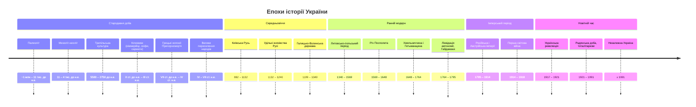

# Хронологічна карта історії України

!!! abstract "Що тут"
    Системний кістяк усіх 32 блоків програми НА СБ України 2025.
    Кожен блок прив'язаний до періоду й кількох ключових подій-маркерів. Колонка «Сторінка» — прокликалка на повний матеріал блоку.
    Використовуй цю сторінку як **карту повторення**: пройдися по таблиці зверху вниз і перевір, чи кожна назва блоку викликає 5-7 опорних асоціацій.

## Велика хронологія: 4 ери × 8 блоків

=== "І. Стародавня й середньовічна (1-5)"

    | № | Період | Блок | Опорні маркери |
    |---:|---|---|---|
    | 1 | методологічний | [Вступ до історії України](блоки/01-вступ.md) | історія як наука; 4 типи джерел; періодизація |
    | 2 | до 800 н.е. | [Стародавня історія](блоки/02-стародавня-історія.md) | Трипілля; кочовики залізного віку; античні колонії; перші слов'яни |
    | 3 | IX–XII ст. | [Русь-Україна (Київська держава)](блоки/03-київська-русь.md) | 882 (Олег), 988 (Хрещення), 1019-1054 (Ярослав), Руська правда |
    | 4 | XIII–XIV ст. | [Галицько-Волинська держава](блоки/04-галицько-волинська.md) | 1199 (об'єднання), 1238-1264 (Данило Галицький), монгольська навала |
    | 5 | XIV – перша половина XVI | [Литовсько-польський період](блоки/05-литовсько-польський-період.md) | 1385 (Кревська унія), Кримське ханство, виникнення козацтва |

=== "ІІ. Ранньомодерна (6-11)"

    | № | Період | Блок | Опорні маркери |
    |---:|---|---|---|
    | 6 | друга половина XVI | [Річ Посполита (XVI)](блоки/06-річ-посполита-xvi.md) | 1569 (Люблінська унія), 1596 (Берестейська унія), Запорозька Січ |
    | 7 | перша половина XVII | [Річ Посполита (XVII)](блоки/07-річ-посполита-xvii.md) | морські походи, повстання 1620-1630, «Ординація» 1638 |
    | 8 | 1648-1657 | [Хмельниччина](блоки/08-хмельниччина.md) | Жовті Води, Корсунь, Берестечко, Зборів, Білоцерківський мир, Переяславська рада 1654 |
    | 9 | 50-80-ті XVII | [Гетьманщина та Руїна](блоки/09-гетьманщина-руїна.md) | Виговський (Конотоп 1659), Дорошенко, Андрусівське перемир'я 1667 |
    | 10 | кінець XVII – перша половина XVIII | [Мазепа і Північна війна](блоки/10-мазепа.md) | 1687-1709 Мазепа, 1708 перехід до Карла XII, Полтава 1709, Києво-Могилянська академія |
    | 11 | друга половина XVIII | [Ліквідація автономії](блоки/11-ліквідація-автономії.md) | 1764 ліквідація гетьманства, 1775 ліквідація Січі, поділи Речі Посполитої 1772/1793/1795 |

=== "ІІІ. Імперська й «довге XIX» (12-19)"

    | № | Період | Блок | Опорні маркери |
    |---:|---|---|---|
    | 12 | кінець XVIII – перша половина XIX | [Російська імперія (поч. XIX)](блоки/12-російська-імперія-початок-xix.md) | 1846-1847 Кирило-Мефодіївське братство, Шевченко, промисловий переворот |
    | 13 | кінець XVIII – перша половина XIX | [Австрійська імперія (поч. XIX)](блоки/13-австрійська-імперія-початок-xix.md) | «Руська трійця» (Шашкевич), 1837 «Русалка Дністровая», 1848 Головна руська рада |
    | 14 | кінець XVIII – перша половина XIX | [Культура XVIII-XIX](блоки/14-культура-кінця-xviii-першої-половини-xix.md) | Котляревський, Шевченко, «Історія русів», Галицько-руська матиця |
    | 15 | друга половина XIX | [Наддніпрянщина (друга пол. XIX)](блоки/15-наддніпрянщина-друга-половина-xix.md) | 1853-1856 Кримська війна, реформа 1861, журнал «Основа», громадівський рух, Емський указ 1876 |
    | 16 | друга половина XIX | [Західна Україна (друга пол. XIX)](блоки/16-західна-україна-друга-половина-xix.md) | 1868 «Просвіта», 1873 НТШ, 1890 РУРП, трудова еміграція |
    | 17 | друга половина XIX – початок XX | [Культура XIX-XX](блоки/17-культура-другої-половини-xix.md) | Куліш, Нечуй-Левицький, Старицький, Лисенко, Терещенки, Ханенки |
    | 18 | 1900-1914 | [Наддніпрянщина 1900-1914](блоки/18-наддніпрянщина-1900-1914.md) | РУП 1900, революція 1905-1907, Думські громади, Столипін |
    | 19 | 1900-1914 | [Західна Україна 1900-1914](блоки/19-західна-україна-1900-1914.md) | Радикалізація, УГКЦ (Шептицький), січовий рух |

=== "IV. Новітня (20-32)"

    | № | Період | Блок | Опорні маркери |
    |---:|---|---|---|
    | 20 | 1914-1918 | [Перша світова війна](блоки/20-перша-світова.md) | ГУР, СВУ, ЗУР, січові стрільці, Брусиловський прорив |
    | 21 | 1917 – поч. 1918 | [Початок Української революції](блоки/21-українська-революція-початок.md) | 4 універсали УЦР, проголошення УНР 1917-1918, бій під Крутами 29.01.1918, Берестейський мир |
    | 22 | 1918-1921 | [Боротьба за державність](блоки/22-боротьба-за-державність.md) | Гетьманат Скоропадського, ЗУНР, Акт злуки 22.01.1919, Директорія, Зимові походи, Холодний Яр |
    | 23 | 1920-ті | [Комуністичний режим](блоки/23-комуністичний-режим.md) | 1922 СРСР, голод 1921-1923, неп, коренізація 1923-1933 |
    | 24 | 1929-1939 | [Голодомор і терор](блоки/24-голодомор-терор.md) | колективізація, **Голодомор 1932-1933 — геноцид**, Великий терор 1937-1938, Розстріляне відродження |
    | 25 | 1918-1939 | [Західна Україна міжвоєнна](блоки/25-західна-україна-міжвоєнна.md) | Польща, Румунія, Чехословаччина; УВО (1920), ОУН (1929), Карпатська Україна (1939) |
    | 26 | 1939-1945 | [Друга світова війна](блоки/26-друга-світова.md) | Пакт 23.08.1939, 22.06.1941, «Новий порядок», Голокост, УПА (1942), визволення 1944, Тегеран/Ялта/Потсдам |
    | 27 | 1945-1953 | [Перші повоєнні роки](блоки/27-перші-повоєнні-роки.md) | ООН (1945), західні кордони, операція «Вісла» 1947, ліквідація УГКЦ 1946, голод 1946-1947 |
    | 28 | 1953-1964 | [Десталінізація](блоки/28-десталінізація.md) | XX з'їзд КПРС 1956, Крим до УРСР 1954, шістдесятники |
    | 29 | 1965-1985 | [Криза радянської системи](блоки/29-криза-радянської-системи.md) | Конституція УРСР 1978, дисиденти, УГГ 1976, кримськотатарський рух, самвидав |
    | 30 | 1985-1991 | [Відновлення незалежності](блоки/30-відновлення-незалежності.md) | Чорнобиль 26.04.1986, Декларація 16.07.1990, Революція на граніті 02.10.1990, Акт 24.08.1991, референдум 01.12.1991 |
    | 31 | 1991-2004 | [Становлення незалежної](блоки/31-становлення-незалежної.md) | Конституція 28.06.1996, гривня 02.09.1996, Помаранчева революція листопад 2004 |
    | 32 | 2005-донині | [Творення нової України](блоки/32-творення-нової-україни.md) | Революція Гідності 2013-2014, Небесна Сотня, анексія Криму 27.02.2014, рос. агресія, угода з ЄС, безвіз 2017, повномасштабне 24.02.2022 |

## Епохи у візуалізації

!!! tip "Як читати"
    Це textual timeline (Mermaid `timeline`), а не пропорційна шкала часу — періоди показані з рівними проміжками для зручності читання, не за реальною тривалістю. Для пропорційного відчуття масштабу — таблиця нижче (стародавня доба триває 99% усієї історії).

## Куди далі

- [Ключові дати — must-know](ключові-дати.md): концентрат із 25-30 дат для активного відтворення.
- [Шаблон блоку — приклад на 01](блоки/01-вступ.md): як виглядає повноцінний блок історії на сайті.
- Дашборд: [Підготовка до вступу](../index.md) → чек-лист по предметах.
